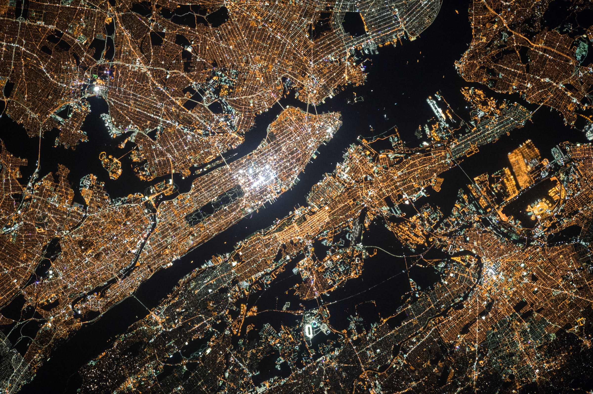

## 👀 Intro
Hi there! I am currently working on a product closely related to cryptocurrency, blockchain and NFT, and am finding many points to explore. The cryptocurrency field is very fluid, with information updated daily. I am looking for answers and researching legislation, policies and ads systems. With this article, I am starting a series of posts about marketing in the cryptosphere where I will share information. I will update as I can, but no promises).

## 🗂 Specific
My product is not tied to a specific country, so I am interested in running as extensive an advertisement as possible. But how do I organize the countries? I have grouped the countries into 3 groups. Not all countries are listed here, but only the main ones or especially interesting for selling cryptocurrencies for individuals and legal entities. 
1) The first group includes the most cryptocurrency-loyal countries. Here there is usually a high competition in advertising auction => more expensive user cost and higher quality.
2) In the second column are "undecided" countries, where there is no clear position on crypto or there are difficulties with public cryptocurrency payments. 
Here mining users is cheaper than in the first group, but their quality is also significant.
3) The third block includes countries where cryptocurrency is banned or severely restricted. I recommend excluding these countries from advertising targeting, because there is a very low percentage of people who use cryptocurrency. At the same time, you can collect a large amount of traffic on the topic of crypto here.

In each group, countries are filtered in descending order of GDP (nominal):

|Priority 1 (Legalized)|Priority 2 (Not prohibited)|Priority 3 (Prohibition)|
| -- | -- | -- |
|USA|UK|China|
|Japan|Russia|Indonesia|
|Germany|Brazil|Turkey|
|France|Mexico|Taiwan|
|Italy|Netherlands|Iran|
|Canada|Saudi Arabia|Vietnam|
|South Korea|Thailand|Bangladesh|
|Spain|Sweden|Egypt|
|Australia|Nigeria|Pakistan|
|Switzerland	|United Arab Emirates|Algeria
|Belgium|Ireland|Morocco|
|Austria|Israel|Bolivia|
|Argentina|Hong Kong|Nepal|
|Norway	|South Africa|Afghanistan|
|Philippines|Denmark||	
|Singapore|Colombia||
|Colombia|Portugal||
|Chile|Kazakhstan||
|Finland|Ecuador||
|Czech Republic|Dominican Republic||
|New Zealand|Uruguay||
|Ukraine|Lithuania||
|Belorussia|Jordan||
|Estonia|Cyprus||
|El Salvador|Iceland||
|Georgia|Armenia||
|Malta|||
## 👉🏻 Conclusions
Before you launch and pay for an ad in your chosen ad network, make sure it is positive about cryptocurrency advertising. Understanding the status of cryptocurrency in the country you want will help you build a competent strategy and save time on account unbundling. By segmenting your ad campaigns by authorized geo, you'll be able to get through moderation faster. 

## 🕵🏻 Sources
Official provisions regarding cryptocurrency and financial services:

[Meta](https://www.facebook.com/policies_center/ads/restricted_content/cryptocurrency_products_and_services)

[Twitter](https://business.twitter.com/en/help/ads-policies/ads-content-policies/financial-services.html)

[Google](https://support.google.com/adspolicy/answer/12055790?hl=en)

---
Wishing you easy moderation and profitable traffic!