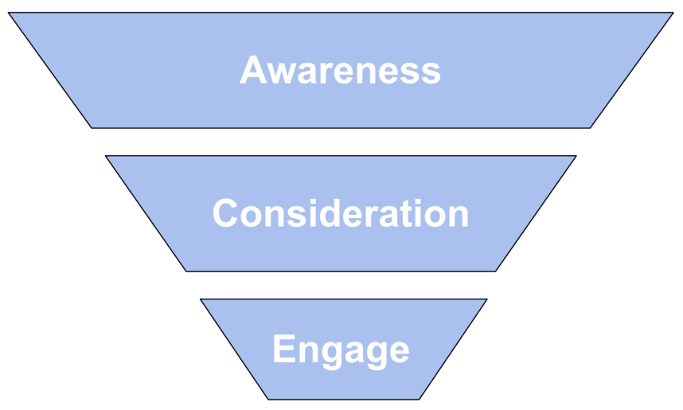
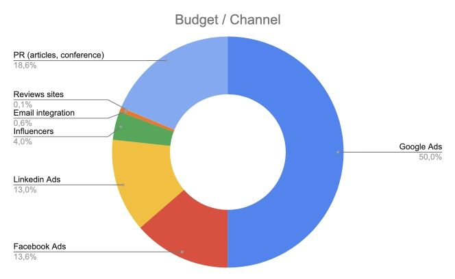

## 👨🏻‍💻 ICP (ideal customer profile)
Examples of reference audience ETL product:

📍 “Marketing analysts working in B2C companies with more than 100 employees located in the US. And they have a decent marketing budget, considering the fact that a company can afford to hire a dedicated marketing analyst. They currently manually export data from advertising and analytics tools or using proprietary tools that doesn’t work as expected. Then they spend hours on data cleansing and preparation. As a result, if they need a report they have to spend hours or days to get it.”

I single out 2 main groups of users who will be interested in the product. The column on the left are those who will set up and use it regularly. The column on the right is the decision maker and the people who will review the reports. The main pains of each group are described below.
| Marketing analysts, marketers|CMO, CTO, VP, CEO|
| --- | --- |
|Collect reports by hand|Need updated reports|
|Dashboard exists but keeps crashing|Need offline and online data in one place|
|Integrations need to be configured manually|Manual reports are tied to one person (risks)|

The sales cycle b2b product is long and you need to work with knowledge smoothly down the funnel. The strategy highlights the most effective channels for attracting. In the future, they can be supplemented by others (for example, Twitter, Video Display).

Here is a more detailed description of how to work with the marketing analysts segment.

## 📣 Marketing Funnel
In this article, we will look at the preferred opportunities for external marketing by funnel.

1️⃣ **Awareness**
- **PR**
    - Conference: joint presentations with clients about cases
    - Collaboration - upselling with another martech product (for example, mailing automation, advertising automation, CRM)
    - Hold a joint analytics conference with competitors
    - Publication in trade journals and research
    - Release of professional podcasts, e-books
- **Thematic email-integration**
    - Integration into professional niche mailings from industrial researchers, educational resources.

💡 In all the materials storytelling is king 👑

2️⃣ **Consideration**
- **SEO**
- **Influencers**
    - Make integrations with opinion leaders in the field of analytics and data visualization
    - Choose a brand ambassador who maintains a professional data analytics blog. Give him access to review and referrals to the service.
    - Search for influencers → [https://ninjaoutreach.com/](https://ninjaoutreach.com/)
    - → [https://influencermarketing.ai/](https://influencermarketing.ai/)
- **SERM: Review sites**
    These sites are quite popular in the US and generate good organic traffic. Ensure regular updates on Improvado reviews from users. Sites examples:
    - → [https://www.softwareadvice.com/categories/](https://www.softwareadvice.com/categories/)
    - → [https://www.g2.com/products/improvado-improvado/reviews](https://www.g2.com/products/improvado-improvado/reviews)
    - → [https://www.capterra.com/p/232276/Improvado/](https://www.capterra.com/p/232276/Improvado/) etc.

3️⃣ **Engage**
- **SMM**
- **Email (internal)**
- - **Google Ads structure:**    
    - General keywords (ex: analytics dashboard, widget google analytics, data sampling)
    - Integrations keywords (ex: facebook analytics API, youtube analytics extension, bigquery integration, looker bi tool)
    - Martech keywords (ex: zappier price, pipedrive login, salesforce limits, queueable apex)
    - Brand keywords
    - Onecent campaign, funnel top (ex: excel for data analysis, analyst job, url shortener, swot analysis, utm builder, commerce cloud, tableau error code)
    - Competitors, relevant keywords (ex: factors ai pricing, adverity competitors, fivetran connectors, panoply reviews, skyvia salesforce)
    - Smart targeting (automatically)
    - Remarketing (ex: visited more than 3 times, spent more than 5 minutes on the site, left mail and disappeared)
    - Look-a-like (improvado visitors, lists of current clients, list of users of competitors)
    - Dynamic remarketing (to all audiences with cards of top blog articles)
    - GDN Competitors URL (website visitors)
- **Linkedin ads target structure**
    - Company (Enterprise)
    - Education (data analyst, math statistics) Degrees, Fields of Study, and Member Schools
    - Job Experience (ex: marketing analyst, analyst, head of analytics, product analyst)
    - Interests (professional interests: BI, analytics, dashboards, Low-code visualization)
    - Remarketing (site visitors hot/cold, engaged post readers)
    - Use the Sales navigator to collect contacts → [https://business.linkedin.com/sales-solutions/sales-navigator/customer-resources](https://business.linkedin.com/sales-solutions/sales-navigator/customer-resources)
- **Facebook ads structure:**    
    - Interests (professional interests: analytics, dashboards, visualization)
    - Communities (BI, CRM, BPM, Low-code, RPA, ERP, ex: [https://www.facebook.com/groups/saasproductsandmarketing/](https://www.facebook.com/groups/saasproductsandmarketing/))
    - Remarketing (site visitors hot/cold, engaged post readers)
    - Custom audience (contacts from open sources)
    - Look-a-like (custom audience, site visitors, engaged readers)
    - Dynamic remarketing (to all audiences with cards of top blog articles)
    - Lead generation (automatically)

💡 Communication at every step of the funnel by remarketing
- 💡 Main target is hypothesis testing:   
    - Which segment responds best?
    - Which creatives trigger the most?
    - Where is the large volume of relevant audience?
    - Money usage: X tests for Y money

## 💵 Budget example

## 📌 Сonclusions
Since the US market is very segmented, it is important to be as targeted as possible in general to the audience. If we are talking about the niche of marketing analysts, then it is important to gradually penetrate into all areas of their professional life. And win the professional trust of an expert among already known competitive solutions.

💡 We sell to decision maker → we need big funnel to get conversions

We should meet them everywhere: professional conferences, articles of their favorite bloggers, performance marketing tools. And our call to action is are narrow finishing targeting.
